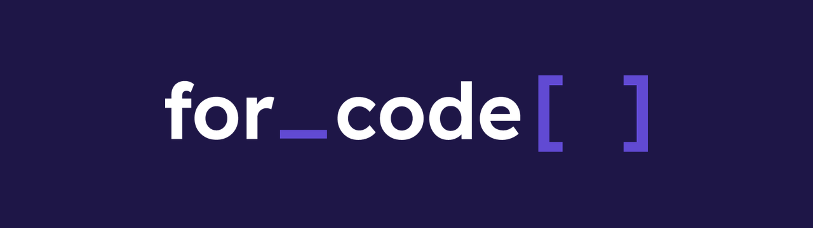
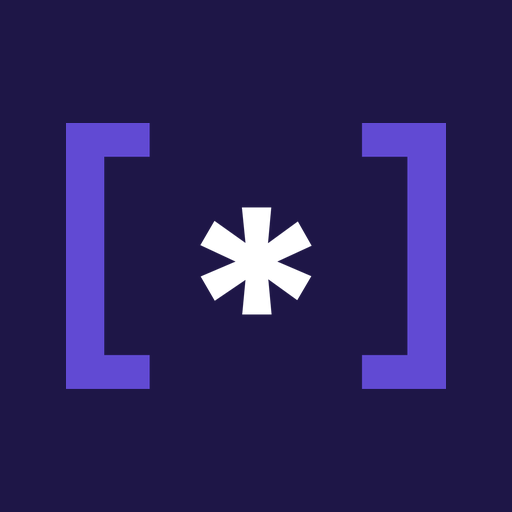

<div align="center">



### A liga de computação da Escola de Química da UFRJ 👨🏼‍💻⚗💜

[](https://www.instagram.com/forcodeufrj/)
[](https://www.linkedin.com/company/for-code)
[](https://www.youtube.com/@for_code)
[](mailto:projetos.forcode@gmail.com)

</div>

---

## 🙋‍♀️ Quem somos

Somos a **for_code**, a liga acadêmica de computação da Escola de Química da
UFRJ, fundada em **17 de março de 2021**. Feita por estudantes, para
estudantes, na Cidade Universitária — Rio de Janeiro. 💻

## 🤔 Por que existimos?

Para trazer a computação como ferramenta para a solução de problemas de
engenharia à comunidade da Escola de Química.

## 🚀 O que nos guia

```text
[*] Simplicidade
[*] Comunicação
[*] Curiosidade
```

## 📚 O que a gente faz

Cursos gratuitos, gravados e abertos no nosso
[canal do YouTube](https://www.youtube.com/@for_code/playlists) 👇

| Trilha | Cursos |
| :-- | :-- |
| 🐍 **Python** | [Python Básico Aplicado a Processos Químicos](https://www.youtube.com/playlist?list=PLSL3Gm4CBwHGx7GFcFLR1nVsl8nXZ7OPW) · [Python Científico](https://www.youtube.com/playlist?list=PLSL3Gm4CBwHHfcZDW3hIgoyvYMTFGf7sc) · [Import RDKit](https://www.youtube.com/playlist?list=PLSL3Gm4CBwHGWufaMHq3y8pN7KvbZzm1W) · [Pymunk](https://www.youtube.com/playlist?list=PLSL3Gm4CBwHG55MMxMzfjeTXk9nAQSeEk) |
| 🗄️ **Dados** | [Projeto MySQL](https://www.youtube.com/playlist?list=PLSL3Gm4CBwHE6ioRaMF5iZt67Ftb12bbw) · [Excel Fundamental](https://www.youtube.com/playlist?list=PLSL3Gm4CBwHE3BE6pD61rR-W1v3JiFvtj) |
| 🔌 **Hardware** | [Arduino aplicado a processos industriais](https://www.youtube.com/playlist?list=PLSL3Gm4CBwHFI4SowCDop3dHjyeH8MW6c) |
| 🌐 **Web** | [Desenvolvimento web Front-End](https://www.youtube.com/playlist?list=PLSL3Gm4CBwHGFCp-uFIyqEeCmp5TfzuEj) |
| 📋 **Gestão** | [Gerenciamento de Projetos em Scrum](https://www.youtube.com/playlist?list=PLSL3Gm4CBwHHh14rfodbnF6lCCAi2uiGq) · [Gerenciamento de Projetos em Cascata](https://www.youtube.com/playlist?list=PLSL3Gm4CBwHFYDSzUW-scjiIr_HAGfkEw) |
| 📖 **Leitura** | [Resumo do livro *Computer Science Distilled*](https://www.youtube.com/playlist?list=PLSL3Gm4CBwHGgaY6MJagf1eN3GU7AUTEr) |

Além dos cursos, a gente já marcou presença na [**SEQ 2023**](https://www.youtube.com/playlist?list=PLSL3Gm4CBwHFcvr2mpMbrEZ7yOmSAZIwe)
e toca projetos coletivos aqui no GitHub.

## 🛠️ Projetos

| Repositório | O que é |
| :-- | :-- |
| [`bots`](https://github.com/forcode-ufrj/bots) | Bot para o Discord oficial da liga, em Python com `discord.py`. |

## 🤝 Bora junto?

Quer aprender a programar, colocar a computação a serviço da engenharia ou
só trocar uma ideia? Segue a gente nas redes e fica de olho no
**Processo Seletivo**. 🤩

Seria possível dar uma força pra gente compartilhando nosso conteúdo? Desde
já, muito obrigado! 💜

---

<div align="center">



<sub>O asterisco é a engrenagem da engenharia; os colchetes, a computação.</sub>

</div>
